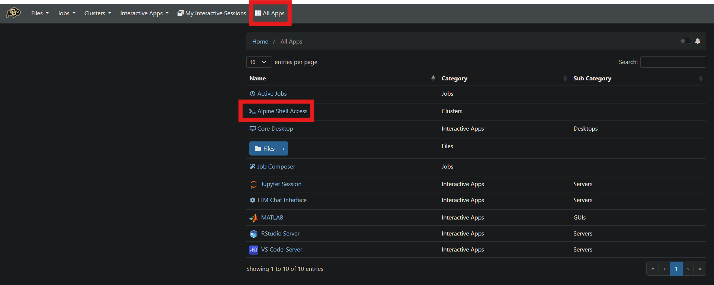
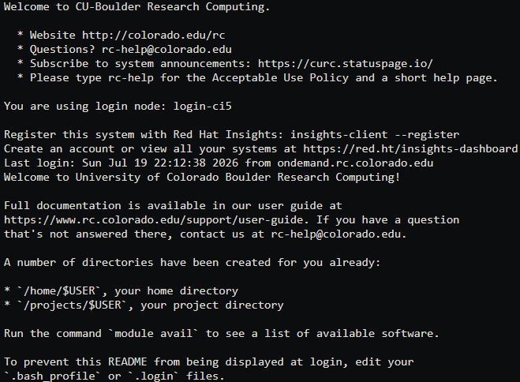

# G-LOC-Prediction

This repository contains the current G-LOC prediction pipeline for normal, temporal, and sensor ablation studies.

## What lives here

- `src/main.py` is the main entry point for each of the different pipeline modes.
- `configs/' is a directory containing YAML configuration files for each modes.
    - `configs/master.yaml` is the master configuration file that has configurations for all modes and data settings.
- `data/` contains the input CSV files and supporting datasets used by the pipeline. Any folder can serve as a data
  source.
- `Results/` is where cross-validation results and sensor ablation results are stored. Any folder can serve as a results
  destination.

## Setting up the Environment

The project is configured for the using Conda to setup the environment. That environment includes the cuML (GPU-enabled
sklearn model training) stack used by the current pipeline.

I recommend using [Miniconda](https://www.anaconda.com/docs/getting-started/miniconda/main). Conda helps manage package
dependencies and versions since some developers may make changes that break other packages.

Which environment YAML file to use depends on your system.

### CPU-Only Environment

This section applies if you do not have a NVIDIA GPU on your system. With this setup, model training will be very slow
but still possible.

I wouldn't recommend performing any model training here, and instead to use a system with a NVIDIA GPU to perform model
training to utilize the GPU packages. However, this environment can be used for general development.

Run the following to setup the environment:

```bash
conda env create -f environment-cpu.yaml
conda activate gloc
```

### NVIDIA GPU on Windows

This section applies if you have a NVIDIA GPU, but your development environment is primarily on Windows. The developers
of the cuML package have restricted the download to Linux environments, so it can't be fully utilized yet. Regardless,
this still enables PyTorch GPU acceleration for training deep learning models faster.

First, open up a terminal (like Windows PowerShell) and run the command:

```bash
nvidia-smi
```

and look at the top left of the output. It should say something about "CUDA Version".

Then, go into the `environment-gpu-windows.yaml` file and look for the line

```yaml
      - --extra-index-url https://download.pytorch.org/whl/cu132
```

If the CUDA version is anything before 13.0, then change the "132" at the end to "126".\
If the CUDA version is either 13.0 or 13.1, then remove this line.\
If the CUDA version is 13.2+, then leave this line as-is.

Make sure to save the file and run the following to setup the environment:

```bash
conda env create -f environment-gpu-windows.yaml
conda activate gloc
```

### NVIDIA GPU on Linux (or WSL) (**Recommended**)

This section applied if you have both a NVIDIA GPU and your development environment is on Linux. For Windows users, you
can use [Windows Subsystem for Linux (WSL)](https://learn.microsoft.com/en-us/windows/wsl/install).

First, open up a terminal (like Windows PowerShell) and run the command:

```bash
nvidia-smi
```

and look at the top left of the output. It should say something about "CUDA Version".

Then, go into the `environment-gpu-linux.yaml` file and look at the line:

```yaml
  - cuda-version>=13.0,<=13.2
```

If the CUDA version is less than 12.2, then look into updating your NVIDIA drivers.\
If the CUDA version is between 12.2 and 12.9, then replace this line with the following: `cuda-version>=12.2,<=12.9`\
If the CUDA version is 13.0+, then leave this line as-is.

```yaml
      - --extra-index-url https://download.pytorch.org/whl/cu132
```

If the CUDA version is less than 12.6, then look into updating your NVIDIA drivers.\
If the CUDA version is between 12.6 and 12.9, then change the "132" at the end to "126".\
If the CUDA version is either 13.0 or 13.1, then remove this line.\
If the CUDA version is 13.2+, then leave this line as-is.

Make sure to save the file and run the following to setup the environment:

```bash
conda env create -f environment-gpu-linux.yaml
conda activate gloc
```

## Running the Pipeline

Run the main module from the repository root (G-LOC-Prediction/) with a specific YAML configuration file:

```bash
python -m src.main --config /configs/your_config.yaml
```

## YAML Configuration

The GLOC pipeline is controlled entirely by the YAML configuration files. The config uses a **mode-based architecture**
where only sections with `enabled: true` execute.

### Configuration Structure

The config file has the following top-level sections:

- **Root parameters**: `data_path` (required by all modes)
- **Shared parameters**: Data preprocessing settings used by all modes for the data pipeline
- **Advanced parameters**: KNN imputation settings for advanced data pipeline
- **Traditional parameters**: Timing and rate settings for traditional data pipeline
- **Mode sections**: Each execution mode has its own enabled/disabled section

### Root Parameters

#### `data_path`

**Purpose**: Absolute path to the directory containing input CSV files and datasets.

**Available inputs**: Any valid file system path.

**Example**:

```yaml
data_path: /home/gloc/G-LOC-Prediction/data
```

**Constraints**:

- Required by all modes
- Directory must exist and contain expected dataset files

### Shared Data Parameters

These parameters control data preprocessing and are used by all modes. Configure under `shared_data_parameters`:

#### `subject_to_analyze`

**Purpose**: Filter data to a specific subject ID (1-13).

**Available inputs**:

- Subject ID (integer or string) to analyze only that subject.
- `null` to analyze all subjects

**Example**:

```yaml
subject_to_analyze: null  # Analyze all subjects
```

#### `trial_to_analyze`

**Purpose**: Filter data to a specific trial ID (1-6).

**Available inputs**:

- Trial ID to analyze only that trial
- `null` to analyze all trials

**Example**:

```yaml
trial_to_analyze: null  # Analyze all trials
```

#### `analysis_type`

**Purpose**: Selects the analysis mode used by the data pipeline. Complements the `subject_to_analyze` and
`trial_to_analyze` filters.

**Available inputs**: Integer from 0 - 2 (e.g., `2` for default mode).

0: Analyze one trial from one subject (`subject_to_analyze` and `trial_to_analyze` must be set)\
1: Analyze all trials from one subject (`subject_to_analyze` must be set)\
2: Analyze all trials from all subjects

**Example**:

```yaml
analysis_type: 2
```

#### `remove_NaN_trials`

**Purpose**: Whether to discard trials containing NaN values before processing.

**Available inputs**: `true` or `false`

**Example**:

```yaml
remove_NaN_trials: true  # Remove trials with NaNs
```

#### `impute_file_name`

**Purpose**: Filename for saving/loading imputed data from previous runs. Be careful with this since using a different
model, model type, data parameters, etc. will result in different imputed data and loading in an incorrect imputed data
file may result in data leakage.

**Available inputs**: Any valid filename string.

**Example**:

```yaml
impute_file_name: imputed_data.pkl
```

#### `save_impute`

**Purpose**: Whether to save imputed data after running the KNN imputation.

**Available inputs**: `true` or `false`

**Example**:

```yaml
save_impute: false  # Don't save imputation cache
```

#### `load_impute`

**Purpose**: Whether to load imputed data from a previous run, but there must be a saved imputed data file from the
previous run.

**Available inputs**: `true` or `false`

**Example**:

```yaml
load_impute: false  # Don't load imputation cache
```

#### `impute_phase`

**Purpose**: Control when imputation is performed.

**Available inputs**:

`none`: Don't perform imputation\
`pre_feature`: Perform imputation before feature extraction\
`post_feature_remove_rows`: Perform imputation after feature extraction and remove rows with NaN values\
`post_feature_knn`: Perform imputation after feature extraction

**Example**:

```yaml
impute_phase: pre_feature  # Perform KNN imputation on raw data before feature extraction
```

#### `output_feature_dtype`

**Purpose**: NumPy dtype for output feature arrays.

**Available inputs**: `float32`, `float64`, or other valid NumPy dtype strings.

**Example**:

```yaml
output_feature_dtype: float32  # Use 32-bit floating point
```

### Advanced Data Parameters

These parameters control the advanced pipeline behavior for how the data should be processed for the deep learners.
Configure under `advanced_data_parameters`:

#### `n_neighbors`

**Purpose**: Number of nearest neighbors to use for KNN imputation.

**Available inputs**: Positive integer.

**Example**:

```yaml
n_neighbors: 4
```

#### `baseline_window`

**Purpose**: Baseline window duration in seconds for feature extraction. This probably doesn't need to change.

**Available inputs**: Positive float (seconds).

**Example**:

```yaml
baseline_window: 32.5
```

#### `horizon`

**Purpose**: Temporal forecasting horizon in samples. Shifts GLOC labels earlier so the model predicts GLOC events
`horizon` samples into the future (0 = no shift, baseline). Applied per-trial after the train/test split to avoid data
leakage.

**Available inputs**: Non-negative integer (samples).

**Example**:

```yaml
horizon: 0  # No forecasting shift
```

### Traditional Data Parameters

These parameters control timing and sampling for the traditional pipeline. Configure under
`traditional_data_parameters`:

#### `backstep`

**Purpose**: Look-back window in seconds for traditional feature extraction. Probably doesn't need to change.

**Available inputs**: Non-negative float (seconds).

**Example**:

```yaml
backstep: 0
```

#### `data_rate`

**Purpose**: Sampling rate in Hz (samples per second). Probably doesn't need to change.

**Available inputs**: Positive integer.

**Example**:

```yaml
data_rate: 25  # 25 Hz sampling
```

#### `offset`

**Purpose**: Time offset in seconds for data alignment. This is the parameter to change to perform the temporal
experiments (to offset the GLOC label) instead of the standard experiments.

**Available inputs**: Non-negative float (seconds).

**Example**:

```yaml
offset: 0
```

#### `time_start`

**Purpose**: Starting time in seconds for analysis window. Probably doesn't need to change.

**Available inputs**: Non-negative float (seconds).

**Example**:

```yaml
time_start: 0
```

### Mode: Cross-Validation

Run systematic k-fold cross-validation with automatic model-type detection and metric aggregation.

**Purpose**: Perform hyperparameter optimization for each fold and extract median-fold hyperparameters over all folds.

**Section**: `cross_validation`

#### `enabled`

**Purpose**: Whether to run cross-validation mode.

**Available inputs**: `true` or `false`

**Example**:

```yaml
enabled: true
```

#### `models`

**Purpose**: Models to cross-validate.

**Available inputs**: List of model aliases. Available models:

Traditional (sklearn):

- `EGB` (Extreme Gradient Boosting)
- `KNN` (K Nearest Neighbors)
- `RF` (Random Forest)
- `LDA` (Linear Discriminant Analysis)
- `LogReg` (Logistic Regression)
- `SVM` (Support Vector Machine)

Advanced (PyTorch):

- `LSTM` (Long Short-Term Memory)
- `TCN` (Temporal Convolutional Network)
- `Trans` (Transformer)
- `LogRegTS` (Time-Series Logistic Regression)

**Example**:

```yaml
models: [ KNN, RF ]
```

**Constraints**: Must be non-empty when enabled.

#### `model_type`

**Purpose**: Feature extraction configuration for this CV run.

**Available inputs**: Two-item list `[afe_filter, feature_set]`.\
`afe_filter` can be "Complete" (include rows with or without AFE) or "noAFE" (include rows with only no AFE).\
`feature_set` can be "Explicit" (all streams) or "Implicit" (only passive and unprocessed sensor streams).

**Example**:

```yaml
model_type: [ Complete, Explicit ]
```

#### `random_seed`

**Purpose**: Seed for reproducible k-fold splits.

**Available inputs**: Positive integer.

**Example**:

```yaml
random_seed: 42
```

#### `num_splits`

**Purpose**: Number of folds for k-fold cross-validation. Probably shouldn't change since all of our studies have used
10-fold CV.

**Available inputs**: Positive integer.

**Example**:

```yaml
num_splits: 10
```

#### `save_results_folder`

**Purpose**: Base directory for saving cross-validation results.

**Available inputs**: Valid file system path.

**Example**:

```yaml
save_results_folder: Results/Cross_Validation
```

**Output structure**: Results are saved to `{save_results_folder}/{model_type}/{model_name}/` with metrics and
hyperparameters.

#### `class_weight`

**Purpose**: How to handle class imbalance in model training.

**Available inputs**:

- `null` - Don't adjust class weights
- `balanced` - Adjust weights inversely to class frequency so that the class label representation are more balanced.

**Example**:

```yaml
class_weight: null
```

#### `advanced_hpo`

**Purpose**: Hyperparameter optimization settings for advanced (PyTorch) models. Required when any advanced model is in
the `models` list. Ignored for traditional-only runs.

**Available inputs**: Sub-section with the following fields:

##### `use_sampler`

**Purpose**: Whether to use a weighted sampler to address class imbalance during Optuna trial training and final model
training.

**Available inputs**: `true` or `false`

**Example**:

```yaml
use_sampler: true
```

##### `final_early_stop`

**Purpose**: Whether the final trained model (after HPO) should use early stopping on a held-out validation split. When
`true`, 20% of the training data is held out for validation and training stops when the validation metric stops
improving. When `false`, the model trains for a fixed number of epochs using all training data.

**Available inputs**: `true` or `false`

**Example**:

```yaml
final_early_stop: false
```

##### `objective_var`

**Purpose**: Optimization metric used by Optuna to evaluate each trial. Case-insensitive.

**Available inputs**: `F1` or `Acc`

**Example**:

```yaml
objective_var: F1
```

##### `trials`

**Purpose**: Number of Optuna HPO trials to run per cross-validation fold. Each trial samples a hyperparameter
configuration, trains a candidate model, and evaluates it on a validation split. Set to `0` to disable HPO entirely
(models train with default hyperparameters).

**Available inputs**: Non-negative integer.

**Example**:

```yaml
trials: 100
```

**Constraints**:

- Required when any advanced model is in the `models` list. A missing `advanced_hpo` section will raise a `KeyError` at
  runtime.
- Optuna-level parameters (sampler type, pruner settings, timeout) are hardcoded defaults and not exposed in the YAML
  config.

### Mode: Sensor Ablation Training

Enable and configure stream ablation experiments with sensor ablation training mode.

**Purpose**: Train models on different combinations of sensor streams and save their performance.

**Section**: `sensor_ablation.training`

#### `enabled`

**Purpose**: Whether to run sensor ablation training.

**Available inputs**: `true` or `false`

**Example**:

```yaml
sensor_ablation:
  training:
    enabled: true
```

#### `save_results_folder`

**Purpose**: Directory where sensor ablation F1 scores are saved during training.

**Available inputs**: Relative or absolute path to directory.

**Example**:

```yaml
save_results_folder: Results/Sensor_Ablation
```

#### `save_models_folder`

**Purpose**: Directory where trained fold models are saved for later use, including SHAP analysis.

**Available inputs**: Relative or absolute path to a directory.

**Example**:

```yaml
save_models_folder: ModelSave/Sensor_Ablation
```

**Expected output structure**:

```text
{save_models_folder}/{model_type}/{model_name}/{stream_group}/fold_0.pkl
{save_models_folder}/{model_type}/{model_name}/{stream_group}/fold_1.pkl
...
```

#### `median_hyperparameters_folders`

**Purpose**: Directory where median hyperparameters are saved from cross validation.

**Available inputs**: Relative or absolute path to directory.

**Example**:

```yaml
median_hyperparameters_folders: Results/Cross_Validation
```

**Note**: The `model_type` subfolder is automatically appended to this path (e.g.,
`Results/Sensor_Ablation/Complete_Explicit/`). Stream-specific F1 scores are saved as JSON files organized by model name
within this folder.

#### `models`

**Purpose**: Models to train during sensor ablation.

**Available inputs**: List of model aliases:

- `EGB` (Extreme Gradient Boosting)
- `KNN` (K Nearest Neighbors)
- `RF` (Random Forest)
- `LDA` (Linear Discriminant Analysis)
- `LogReg` (Logistic Regression)
- `SVM` (Support Vector Machine)

**Example**:

```yaml
models: [ KNN, RF ]
```

#### `model_type`

**Purpose**: Feature extraction and selection configuration for this mode.

**Available inputs**: Two-item list `[afe_filter, feature_set]`
`afe_filter` can be "Complete" (include rows with or without AFE) or "noAFE" (include rows with only no AFE).\
`feature_set` can be "Explicit" (all streams) or "Implicit" (only passive and unprocessed sensor streams).

**Example**:

```yaml
model_type: [ Complete, Explicit ]
```

#### `random_seed`

**Purpose**: Random seed for reproducible k-fold splits and model training.

**Available inputs**: Positive integer.

**Example**:

```yaml
random_seed: 42
```

#### `num_splits`

**Purpose**: Number of folds for k-fold cross-validation. Probably shouldn't change since all of our studies have used
10-fold CV.

**Available inputs**: Positive integer.

**Example**:

```yaml
num_splits: 10  # 10-fold cross-validation
```

#### `streams`

**Purpose**: List of sensor stream combinations to evaluate.

**Available inputs**: List of lists, where each inner list contains stream names:

- Single streams: `[ECG]`, `[EEG]`, `[Pupil]`, `[Centrifuge]`, `[Participant]`, `[HR]`, `[BR]`, `[Temperature]`
- Combined streams: `[ECG, HR, BR, Temperature]`, `[EEG, Pupil]`, etc.

**Example**:

```yaml
streams:
  - [ ECG, HR, BR, Temperature ]
  - [ EEG ]
  - [ Pupil ]
  - [ ECG, HR, BR, Temperature, EEG ]
```

**Constraints**: Each stream name is validated against the supported label set. Typos are rejected at runtime.

### Mode: Sensor Ablation Review

Plot previously saved sensor ablation F1 results without retraining.

**Purpose**: Visualize results from sensor ablation training runs. The following sensor stream combinations are renamed:

- `ECG-HR-BR-Temperature` → `Equivital`
- `Participant` → `Demographics`
- `Centrifuge` → `G Force`

**Section**: `sensor_ablation.review`

#### `enabled`

**Purpose**: Whether to reload and replot saved F1 results.

**Available inputs**: `true` or `false`

**Example**:

```yaml
sensor_ablation:
  review:
    enabled: true
```

#### `save_results_folder`

**Purpose**: Directory where sensor ablation results are loaded from during review.

**Available inputs**: Relative or absolute path to directory.

**Example**:

```yaml
save_results_folder: Results/Sensor_Ablation
```

#### `models`

**Purpose**: Models whose cached results to load and visualize.

**Available inputs**: List of model aliases (same as training).

**Example**:

```yaml
models: [ KNN, RF ]
```

**Constraints**: Must be non-empty when review is enabled. Must match model results saved during training.

#### `model_type`

**Purpose**: Feature extraction configuration for locating cached results.

**Available inputs**: Two-item list `[afe_filter, feature_set]` (same format as training).

**Example**:

```yaml
model_type: [ Complete, Explicit ]
```

#### `stream_groups`

**Purpose**: Stream combination to filter and display.

**Available inputs**: List of stream names to match.

**Example**:

```yaml
stream_groups: [ EEG, Pupil ]
```

#### `sort_streams_by_median`

**Purpose**: Whether to automatically sort streams by their median F1 score.

**Available inputs**: `true` or `false`

**Example**:

```yaml
sort_streams_by_median: false
```

**Behavior**:

- When `false`: Displays streams in the order they they are specified in the YAML config file.
- When `true`: Loads saved results for selected sensor streams for selected models then sorts by median F1 score.

**Note**: Must point to the same location used by sensor ablation training so that the plots can be loaded. The
`model_type` subfolder is automatically appended to this path. Review will fail if the specified directory does not
contain results from a prior training run.

### Mode: Feature Space Review

Inspect overlap of selected features across trained models. For traditional classifiers only.

**Purpose**: Analyze which features each model selected and identify shared vs. unique features.

**Section**: `feature_space_review`

#### `enabled`

**Purpose**: Whether to run feature space overlap analysis.

**Available inputs**: `true` or `false`

**Example**:

```yaml
feature_space_review:
  enabled: true
```

#### `models`

**Purpose**: Models whose feature selections to compare.

**Available inputs**: List of model aliases (2-4 models recommended for visualization).

**Example**:

```yaml
models: [ KNN, RF ]
```

**Constraints**: Must be non-empty when enabled. Visualizations support up to ~4+ models (Venn diagrams for ≤3, UpSet
plots for ≥4).

#### `model_type`

**Purpose**: Feature extraction configuration for locating saved model hyperparameters.

**Available inputs**: Two-item list `[afe_filter, feature_set]`.

**Example**:

```yaml
model_type: [ Complete, Explicit ]
```

### Mode: SHAP Analysis

Generate SHAP explanations from saved fold models.

**Purpose**: Load trained fold models from a previous sensor ablation run, recreate the matching data splits, generate
SHAP explanations, save those explanation objects, and optionally create SHAP plots.

**Section**: `shap_analysis`

**Standard use case**: Use this mode after sensor ablation training has already saved fold models.

#### `enabled`

**Purpose**: Whether to run SHAP analysis.

**Available inputs**: `true` or `false`

**Example**:

```yaml
shap_analysis:
  enabled: true
```

#### `plot_saved_only`

**Purpose**: Controls whether SHAP explanations are generated or only loaded for plotting.

**Available inputs**:

- `false` — generate SHAP explanations from saved models, save the explanations, and create plots.
- `true` — skip SHAP generation and only plot previously saved SHAP explanations.

**Example for SHAP generation**:

```yaml
plot_saved_only: false
```

#### `saved_models_folder`

**Purpose**: Directory containing trained fold models from sensor ablation training.

**Available inputs**: Relative or absolute path to a directory.

**Example**:

```yaml
saved_models_folder: ModelSave/Sensor_Ablation
```

**Expected input structure**:

```text
{saved_models_folder}/{model_type}/{model_name}/{stream_group}/fold_0.pkl
{saved_models_folder}/{model_type}/{model_name}/{stream_group}/fold_1.pkl
...
```

#### `save_results_folder`

**Purpose**: Directory where SHAP explanation objects are saved.

**Available inputs**: Relative or absolute path to a directory.

**Example**:

```yaml
save_results_folder: Results/SHAP_Analysis
```

**Expected output structure**:

```text
{save_results_folder}/{model_type}/{model_name}/{stream_group}/fold_0_shap_explanation.pkl
{save_results_folder}/{model_type}/{model_name}/{stream_group}/fold_1_shap_explanation.pkl
...
```

#### `save_plots_folder`

**Purpose**: Directory where SHAP plots are saved.

**Available inputs**: Relative or absolute path to a directory.

**Example**:

```yaml
save_plots_folder: Results/SHAP_Plots
```

#### `model_type`

**Purpose**: Feature extraction configuration used to locate saved models and recreate matching data.

**Available inputs**: Two-item list `[afe_filter, feature_set]`.

**Example**:

```yaml
model_type: !ModelType [ Complete, Explicit ]
```

#### `models`

**Purpose**: Models to explain.

**Available inputs**: List of model aliases with saved fold models.

**Example**:

```yaml
models: [ RF, EGB ]
```

#### `streams`

**Purpose**: Stream groups to explain.

**Available inputs**: List of stream-group lists. These should match the stream groups used when the models were
trained.

**Example**:

```yaml
streams:
  - [ ECG, EEG, Centrifuge, Participant, Pupil ]
```

#### `random_seed`

**Purpose**: Random seed used to recreate the same k-fold splits used during model training.

**Available inputs**: Positive integer.

**Example**:

```yaml
random_seed: 42
```

#### `num_splits`

**Purpose**: Number of folds to recreate and explain.

**Available inputs**: Positive integer.

**Example**:

```yaml
num_splits: 10
```

**Important**: This should match the number of folds used during the original sensor ablation training run.

#### `manual_ablation`

**Purpose**: Controls whether SHAP recreates the data using cached selected features or raw stream-specific features.

**Available inputs**:

- `false` — use cached selected features, matching the standard sensor ablation workflow.
- `true` — use raw stream-specific features.

**Example**:

```yaml
manual_ablation: false
```

**Important**: This should match the setting used when the explained models were trained.

#### `nsamples_train`

**Purpose**: Number of training samples to use for SHAP background/reference data when sampling is needed.

**Available inputs**: Positive integer.

**Example**:

```yaml
nsamples_train: 100
```

#### `nsamples_test`

**Purpose**: Number of test samples to explain when sampling is needed.

**Available inputs**: Positive integer.

**Example**:

```yaml
nsamples_test: 50
```

#### `overwrite`

**Purpose**: Whether to overwrite existing saved SHAP explanation files.

**Available inputs**: `true` or `false`

**Example**:

```yaml
overwrite: false
```

#### `max_display`

**Purpose**: Maximum number of features or feature groups to show in SHAP plots.

**Available inputs**: Positive integer.

**Example**:

```yaml
max_display: 20
```

#### `class_index`

**Purpose**: Class index to plot when the SHAP explanation contains a class dimension.

**Available inputs**: Non-negative integer.

**Example**:

```yaml
class_index: 1
```

For binary classification, `1` usually corresponds to the positive/G-LOC class.

#### `print_vals`

**Purpose**: Whether to print/log SHAP feature values while plotting.

**Available inputs**: `true` or `false`

**Example**:

```yaml
print_vals: true
```

#### Violin plot layout settings

**Purpose**: Control figure size and margins for SHAP violin plots.

**Available inputs**: Positive numeric values.

**Example**:

```yaml
violin_plot_width: 26
violin_plot_height: 10
violin_left_margin: 0.36
violin_right_margin: 0.96
```

#### Example SHAP generation config

```yaml
shap_analysis:
  enabled: true
  plot_saved_only: false

  saved_models_folder: ModelSave/Sensor_Ablation
  save_results_folder: Results/SHAP_Analysis
  save_plots_folder: Results/SHAP_Plots

  model_type: !ModelType [ Complete, Explicit ]
  models: [ RF, EGB ]
  streams:
    - [ ECG, EEG, Centrifuge, Participant, Pupil ]

  random_seed: 42
  num_splits: 10
  manual_ablation: false

  nsamples_train: 100
  nsamples_test: 50
  overwrite: false

  max_display: 20
  class_index: 1
  print_vals: true

  violin_plot_width: 26
  violin_plot_height: 10
  violin_left_margin: 0.36
  violin_right_margin: 0.96
```

---

### Mode: SHAP Plotting

Plot previously saved SHAP explanations without regenerating them.

**Purpose**: Load saved SHAP explanation objects from `save_results_folder` and create plots in `save_plots_folder`.
This is useful when SHAP generation has already been completed and you only want to adjust or regenerate visualizations.

**Section**: `shap_analysis`

**Important**: SHAP plotting uses the same top-level YAML section as SHAP generation. The difference is that
`plot_saved_only` is set to `true`.

#### `enabled`

**Purpose**: Whether to run SHAP plotting.

**Available inputs**: `true` or `false`

**Example**:

```yaml
shap_analysis:
  enabled: true
```

#### `plot_saved_only`

**Purpose**: Skip SHAP generation and only plot saved SHAP explanations.

**Available inputs**: `true`

**Example**:

```yaml
plot_saved_only: true
```

#### `save_results_folder`

**Purpose**: Directory containing saved SHAP explanation objects.

**Available inputs**: Relative or absolute path to a directory.

**Example**:

```yaml
save_results_folder: Results/SHAP_Analysis
```

#### `save_plots_folder`

**Purpose**: Directory where SHAP plots are saved.

**Available inputs**: Relative or absolute path to a directory.

**Example**:

```yaml
save_plots_folder: Results/SHAP_Plots
```

#### `model_type`

**Purpose**: Feature extraction configuration used to locate saved SHAP explanations and name the plot outputs.

**Available inputs**: Two-item list `[afe_filter, feature_set]`.

**Example**:

```yaml
model_type: !ModelType [ Complete, Explicit ]
```

#### `models`

**Purpose**: Models whose saved SHAP explanations should be plotted.

**Available inputs**: List of model aliases.

**Example**:

```yaml
models: [ RF ]
```

#### `streams`

**Purpose**: Stream groups whose saved SHAP explanations should be plotted.

**Available inputs**: List of stream-group lists.

**Example**:

```yaml
streams:
  - [ ECG, EEG, Centrifuge, Participant, Pupil ]
```

#### `num_splits`

**Purpose**: Number of saved fold explanations to load.

**Available inputs**: Positive integer.

**Example**:

```yaml
num_splits: 10
```

#### `plot_scope`

**Purpose**: Controls whether plots are generated per fold, across all folds, or both.

**Available inputs**:

- `individual` — create plots for each fold separately
- `all` — combine saved fold explanations and create one overall plot
- `both` — create both individual-fold plots and combined plots

**Example**:

```yaml
plot_scope: all
```

#### `max_display`

**Purpose**: Maximum number of features or feature groups to show in SHAP plots.

**Available inputs**: Positive integer.

**Example**:

```yaml
max_display: 20
```

#### `class_index`

**Purpose**: Class index to plot when the saved SHAP explanation contains a class dimension.

**Available inputs**: Non-negative integer.

**Example**:

```yaml
class_index: 1
```

For binary classification, `1` usually corresponds to the positive/G-LOC class.

#### `print_vals`

**Purpose**: Whether to print/log SHAP feature values while plotting.

**Available inputs**: `true` or `false`

**Example**:

```yaml
print_vals: true
```

#### Violin plot layout settings

**Purpose**: Control figure size and margins for SHAP violin plots.

**Available inputs**: Positive numeric values.

**Example**:

```yaml
violin_plot_width: 26
violin_plot_height: 10
violin_left_margin: 0.36
violin_right_margin: 0.96
```

#### `grouped_bar_plots`

**Purpose**: Whether to create grouped SHAP bar plots in addition to standard SHAP plots.

**Available inputs**: Sub-section with `enabled: true` or `enabled: false`.

**Example**:

```yaml
grouped_bar_plots:
  enabled: true
```

Grouped SHAP bar plots aggregate individual features into interpretable feature groups such as:

- modalities
- baseline windows
- EEG channels
- EEG bands
- EEG channel-band combinations
- raw versus processed features
- raw versus PSD features

Grouped bar plots can use either summed absolute SHAP values or mean absolute SHAP values if that option is exposed in
the plotting configuration. Summed absolute SHAP values show total contribution by group, while mean absolute SHAP
values normalize by the number of features in each group.

#### Example SHAP plot-only config

```yaml
shap_analysis:
  enabled: true
  plot_saved_only: true

  save_results_folder: Results/SHAP_Analysis
  save_plots_folder: Results/SHAP_Plots

  model_type: !ModelType [ Complete, Explicit ]
  models: [ RF ]
  streams:
    - [ ECG, EEG, Centrifuge, Participant, Pupil ]
  num_splits: 10

  max_display: 20
  class_index: 1
  print_vals: true
  plot_scope: all

  violin_plot_width: 26
  violin_plot_height: 10
  violin_left_margin: 0.36
  violin_right_margin: 0.96

  grouped_bar_plots:
    enabled: true
```

### Complete Example

Here is a complete minimal configuration:

```yaml
data_path: /home/gloc/G-LOC-Prediction/data/

shared_data_parameters:
  subject_to_analyze: null
  trial_to_analyze: null
  analysis_type: 2
  remove_NaN_trials: true
  impute_file_name: imputed_data.pkl
  save_impute: false
  load_impute: false
  impute_phase: pre_feature
  output_feature_dtype: float32
advanced_data_parameters:
  n_neighbors: 4
  baseline_window: 32.5
  horizon: 0
traditional_data_parameters:
  backstep: 0
  data_rate: 25
  offset: 0
  time_start: 0

cross_validation:
  enabled: true
  # Mode-specific parameters
  models: [ KNN, EGB ]
  model_type: !ModelType [ Complete, Explicit ]
  random_seed: 42
  num_splits: 10
  save_results_folder: Results/Cross_Validation
  class_weight: null
  advanced_hpo:
    use_sampler: true
    final_early_stop: false
    objective_var: F1
    trials: 100

sensor_ablation:
  training:
    enabled: true
    save_results_folder: Results/Sensor_Ablation
    median_hyperparameters_folder: Results/Cross_Validation
    # Mode-specific parameters
    models: [ KNN, EGB ]
    model_type: !ModelType [ Complete, Explicit ]
    random_seed: 42
    num_splits: 10
    streams:
      - [ EEG ]
      - [ EEG, Pupil ]
      - [ EEG, Pupil, Participant ]
  review:
    enabled: True
    save_results_folder: Results/Sensor_Ablation
    # Mode-specific parameters for review
    models: [ KNN, EGB ]
    model_type: !ModelType [ Complete, Explicit ]
    stream_groups:
      - [ EEG ]
      - [ EEG, Pupil ]
      - [ EEG, Pupil, Participant ]
    sort_streams_by_median: true

feature_space_review:
  enabled: true
  # Mode-specific parameters
  models: [ KNN, EGB ]
  model_type: !ModelType [ Complete, Explicit ]
  median_hyperparameters_folder: Results/Cross_Validation
```

### Mode Execution

Only modes with `enabled: true` will execute. When you run:

```bash
python -m src.main --config configs/your_config.yaml
```

The pipeline checks each mode's `enabled` flag and runs only those with `enabled: true`. This allows you to configure
multiple modes but selectively enable/disable them without editing the entire config file.

### Notes

- The config file must be valid YAML (not JSON).
- `data_path` is required by all modes.
- Mode-specific parameters (`models`, `model_type`, `random_seed`) are only used by their corresponding modes and must
  be configured within each mode's section.
- The pipeline installs cuML acceleration after config parsing, so RAPIDS dependencies from `environment.yaml` are
  required for GPU acceleration. If no GPU is available or cuML fails to import, then the package will revert to using
  the CPU.

---

# Getting Setup with CU Research Computing

All the documentation for using the CU Research Computing is
located [here](https://curc.readthedocs.io/en/latest/index.html), however there is a lot of information and there aren't
many explanations so the following should help with providing some explanations and guidance.

The ultimate goal of this guide is to successfully be able to run the command
`python -m src.main --configs <config file>` without any error on the CU research computers.

## Getting Started

First, look through the documentation page [here](https://curc.readthedocs.io/en/latest/getting_started/logging-in.html)
which is the official CU Research Computing documentation, which contains most of the information you need to get
started with the research computers. Follow the instructions there to get started. However, there are a couple of things
to note that may be helpful:

* In this documentation, you only really need to go through the following sections:
    * Getting a CURC account
    * Getting access to CURC resources
* Open OnDemand's web interface is likely the best to use since it also includes access to the terminal. However, you
  will still need to have Duo MFA setup as the ssh login still requires this.

## Getting the Code on the Computer

The next thing you would likely need to do is to get the code from the Git repository onto the computer. However, there
is a bit of background that you should know beforehand.

### Filesystems

The CU research computer has three places where you should do your work, where `<identikey>` is a placeholder for your
identikey. Also see the page [here](https://curc.readthedocs.io/en/latest/compute/filesystems.html) in their
documentation for additional information:

* `/home/<identikey>`
    * This is where your personal access keys and other personal things should be stored, since it is recommended that
      you don't share this with others and because this has very limited storage. You'll likely not do much in this
      place.
* `/projects/<identikey>`
    * This location has a lot of storage space and is the place where you should put all the project files and data.
      Files here are not deleted at all so feel free to use this place for storage as well.
* `/scratch/alpine/<identikey>`
    * This location is similar to the `/projects` directory except that the files here get wiped every 90 days. This is
      also where you should actually run the code since the I/O performance is better than on the `/projects` directory.

### Get Code into Projects Directory

Now that you hopefully have a rough understanding of the different directories, you'll need to get the code into the
`/projects/<identikey>` directory. There are a couple of ways you can do this.

#### 1. Clone the Git Repository via SSH

By cloning the git repository via SSH, you can be able to easily pull changes you make on your local computer. The
setup, however, is not as easy.

##### Terminal Access

The first thing you'll need to do is get access to the terminal. In Open OnDemand, you can go to the **All Apps** tab
and go to the **Alpine Shell Access** as seen in the image below.



The first thing you'll see is to login into login node (one of the many computers which handles logging in and terminal
access). The password should be your identikey password, and then you'll be prompted for a Duo authentication. If you
login successfully, you'll see something like this:



You'll start off in the `/home/$USER` directory. Here, you'll need to create Secure Shell (ssh) key. Think of this as a
string of text that can be used to get authorization to your GitHub accounts (and more). However, this string of text is
hashed and encrypted so it's not literally just a string.

To generate an ssh key, look at the official GitHub documentation on doing
so [here](https://docs.github.com/en/authentication/connecting-to-github-with-ssh/generating-a-new-ssh-key-and-adding-it-to-the-ssh-agent?platform=linux)
(you can ignore the "Generating a new SSH key for a hardware security key" section). This ssh key should live in your
`/home/$USER` directory, so it definitely shouldn't be shared.

> **NOTE** - Automatic SSH Key Adding to Agent
>
> If you followed the documentation linked above, you went through the steps to register your ssh key through the ssh
> agent. This process is not automatic by default and you must register your ssh key every time.
>
> To make this automatic, run the command `cd /home/$USER/.ssh`. This is precisely where your ssh key is stored.
>
> There is also a `config` file that we need to edit. To do so, run `nano config` or `vim config` (if you know how to
> use vim). Then you need to paste in the following to the end of the file:
> ```aiignore
> StrictHostKeyChecking no
> Host *
>     AddKeysToAgent yes
>     IdentityFile ~/.ssh/<ssh file name>
> ```
> For the `<ssh file name>`, it's likely `id_ed25519` if you didn't change its name.
>
> To save and exit: Ctrl + X -> Y (overwrite file contents) -> Enter (save contents to same filename).

Now, go to your projects directory:

```
cd /projects/$USER
```

Clone the repository:

```
git clone git@github.com:aaronallred/G-LOC-Prediction.git
```

If the command above fails with something related to "you don't have permission" this means that your ssh key isn't
working. I would first make sure the ssh key has been added to the agent, making sure that you correctly added the ssh
key to your GitHub account, and then generating a new ssh key as a last resort.

#### 2. Clone the Git Repository via HTTPS

TODO - I recommend going with the SSH route for now. Will update this section when absolutely needed.

#### 3. Copy the Project Files from Local Computer to the Research Computer

Refer to the next section to see how to transfer large files into the computer.

## Getting Data into the Computer

### Globus (Recommended)

Refer to the official CURC documentation page [here](https://curc.readthedocs.io/en/latest/compute/data-transfer.html)
to get Globus setup. You'll need to setup your own endpoint by
installing [Globus Connect Personal](https://www.globus.org/globus-connect-personal) and following the instructions on
that page to get the endpoint setup.

Then, to perform the file transfer on the Globus web app, you need to have `/projects/<your identikey>/G-LOC-Prediction`
on one side and your local `G-LOC-Prediction` on the other side. Select the `data` folder from your side and press the "
Start" button.

> If you don't have the `G-LOC-Prediction` folder in `/projects/<your identikey>`, refer to the "Getting the Code on the
> Computer" section. Alternatively, just transfer the entire `G-LOC-Prediction` folder.

You'll then need to wait until the transfer finishes processing.

### Open OnDemand

If you have a lot of time and patience, you can do all file management through the files tab in Open OnDemand.

To do so, go to the "Files" tab and go to the `/projects/<your identikey>` option.

> You might also see a `/pl` directory. On the official CURC documentation about filesystems, this is a "fee-based
> compute-capable storage platform" so you don't need to worry about this.

> If you don't have the code in here already, refer to the "Getting the Code on the Computer" section.
>
> The third way of getting the code into the computer is to upload the entire G-LOC-Prediction folder from your local
> computer to this
> directory (this will take a long time).

You should see the G-LOC-Prediction folder here. Go into it and you'll see that the data folder is not in here. To get
the data in the folder via Open OnDemand, just upload your local `data` folder into this directory (this will take a
very long time).

## Setting up the Environment

We need to ensure that we have the conda environment setup on the research computer to run the code properly. As far as
I know, there is not easy GUI to perform a majority of the work here, so you'll need to use the terminal.

To access the terminal, in Open OnDemand go the **Clusters** -> **Alpine Shell Access** tab and login to the computer.
The research computer has multiple nodes which are
described [here](https://curc.readthedocs.io/en/latest/compute/node-types.html).

### CPU Environment

Go to your `/projects/$USER` directory after logging in. We cannot install the environment on the login node because
there isn't enough resources (and it isn't allowed). So, we need to use a different node. A lot of information on using
different nodes can be found in the official Alpine Hardware
guide [here](https://curc.readthedocs.io/en/latest/clusters/alpine/alpine-hardware.html).

To enter the necessary node, run the following command (used for compiling code and such):

```
acompile
```

From here, use the command `pwd` and verify that you are in your `/projects/$USER` directory. If not, then go to this
directory. Then, go into your `G-LOC-Prediction` folder.

Then, run the following commands:

```
module purge
```

```
module load miniforge
```

> **NOTE:**
>
> The research computer uses a modules system, where the documentation for it can be
> found [here](https://curc.readthedocs.io/en/latest/compute/modules.html).
>
> Modules are pieces of software that come pre-installed on the research computers and are recommended to be used since
> it saves you some sanity of installing the software yourself.

In the repository, there should be a `environment-curc-cpu.yaml` file. If there isn't, make sure your repository is up
to date and that you are on the correct branch. To install the environment, run the command:

```
mamba env create -f environment-curc-cpu.yaml
```

You may be asked a few prompts, so just accept those. Some of those are just accepting terms of use and some others are
confirmations to install all the packages listed.

After installing, run the following command to verify that the environment was successfully installed:

```
mamba activate gloc-cpu
```

### GPU Environment

TODO -> Package installation might be unstable depending on which machine is being used. At a high level, refer to the "
Special-Purpose GPU Resources" section in the Alpine Hardware documentation page to use the gpu testing node and install
the `environment-curc-gpu.yaml` file instead.

## Running a Job

### Open OnDemand (Recommended)

In Open OnDemand, go to the **Jobs** -> **Job Composer**. This tab makes it easy to create a bash script and run the
jobs. To start creating a bash script, press the "New Job" button in the top-left and select "From Default Template".

From here, you could configure a few things in with the "Job Options" button if you want to.

From here, on the right you should be able to see what the bash script looks like. At the bottom, press the "Open
Editor" button to edit this script.

Here is a better template for this bash script which I recommend using:

```
#!/bin/bash
#SBATCH --partition=amilan          # Use standard CPU partition
#SBATCH --qos=normal                # Use standard CPU QOS
#SBATCH --nodes=1
#SBATCH --ntasks=1
#SBATCH --cpus-per-task=8           # Request 8 CPU cores
#SBATCH --mem=64G                   # Request 64 GB of RAM
#SBATCH --time=23:50:00             # Max walltime (under 24h)
#SBATCH --job-name=<job name here>
#SBATCH --output=gloc_ml_%j.log

# Clean existing module path and load miniforge
module purge
module load miniforge
conda activate gloc-cpu

# Define directory variables for readability
PROJECT_DIR="/projects/$USER/G-LOC-Prediction"
SCRATCH_DIR="/scratch/alpine/$USER/G-LOC-Prediction"

# Copy files into scratch
mkdir -p "$SCRATCH_DIR"
rsync -a "$PROJECT_DIR/" "$SCRATCH_DIR/"

# Execute your python script
cd "$SCRATCH_DIR"
python -m src.main --config configs/real_time_sensor_ablation.yaml

# Copy all results back to projects
rsync -a --delete "$SCRATCH_DIR/" "$PROJECT_DIR/"

# Message to demonstrate that it completed instead of crashed
echo "Fully completed"

exit
```

Make sure to fill out the following:

* `<job name here>` with your job name
* `<your config here>` with your YAML config file

Press the save button in the top-left, then go back to the Job Composer tab. In this tab, select the job you want to
run, then press the green "Submit" button. This will put it in the queue to run and you can only wait from here.

### Via Terminal

TODO - Need to create your own .sh file and create a job for it in the terminal.

## Getting Stuff Back in Local

Once the job finished, the script should have copied the contents of the repository in the `/scratch` directory back
into your `/projects` directory. On Open OnDemand, you can go to the **Files** tab and download whatever results or
other files and folders that were generated after running your job.