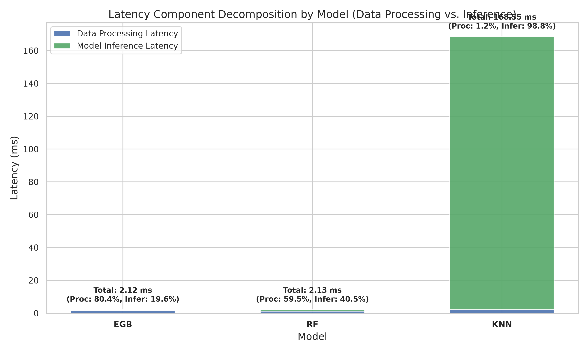
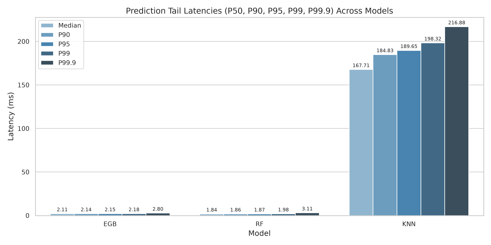
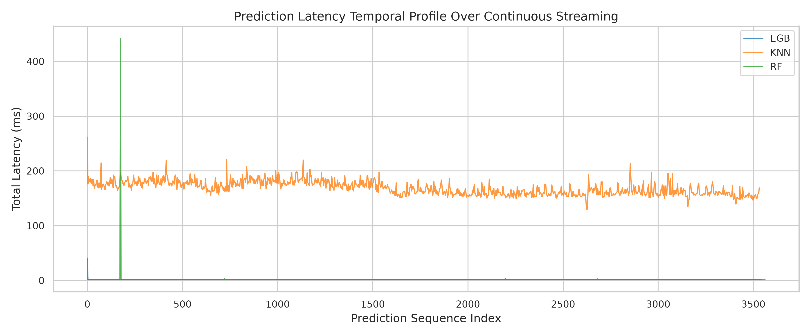

# Real-Time G-LOC Prediction: Comprehensive Latency & Processing Analysis Report

## Executive Summary
This report evaluates the computational latency profiles of machine learning models performing real-time **G-Induced Loss of Consciousness (G-LOC)** prediction on continuous physiological and centrifuge telemetry streams.

### Key Performance Findings:
* **Fastest Model:** `EGB` with a mean total latency of **2.1238 ms** (Throughput: **470.8 predictions/sec**).
* **Slowest Model:** `KNN` with a mean total latency of **168.5517 ms** (Throughput: **5.9 predictions/sec**).
* **Telemetry Streaming Period ($1 / 25\text{ Hz}$):** **40.0 ms** between raw sample packet arrivals. Intermediate sample buffer updates take $< 0.005\text{ ms}$.
* **Stride Prediction Deadline ($0.25\text{ s}$ Stride):** **250.0 ms** per prediction window.

---

## Latency Summary & Component Breakdown

| Model | Streams | N | Mean Total (ms) | Std Total (ms) | Median Total (ms) | P95 Total (ms) | P99 Total (ms) | Max Total (ms) | Mean Data Proc (ms) | Mean Inference (ms) | Data Proc (%) | Inference (%) | Throughput (preds/sec) |
| --- | --- | --- | --- | --- | --- | --- | --- | --- | --- | --- | --- | --- | --- |
| EGB | ECG-HR-BR-Temperature-Centrifuge | 3543 | 2.1238 | 0.6515 | 2.1102 | 2.1510 | 2.1780 | 40.8309 | 1.7080 | 0.4158 | 80.4200 | 19.5800 | 470.8491 |
| RF | ECG-HR-BR-Temperature-Centrifuge | 3563 | 2.1277 | 12.0351 | 1.8380 | 1.8740 | 1.9806 | 569.5395 | 1.2658 | 0.8619 | 59.4918 | 40.5082 | 469.9987 |
| KNN | ECG-HR-BR-Temperature-Centrifuge | 3533 | 168.5517 | 12.3812 | 167.7090 | 189.6507 | 198.3161 | 261.1435 | 2.0887 | 166.4630 | 1.2392 | 98.7608 | 5.9329 |

---

## Statistical Significance Analysis
To verify whether latency differences between evaluated models are statistically significant, a **Kruskal-Wallis H-test** was performed across model prediction latencies:
* **H-Statistic:** `9418.757739185728`
* **p-value:** `0.0000e+00`
* **Statistically Significant ($\\alpha=0.05$):** `True`

### Pairwise Mann-Whitney U Tests (Bonferroni Corrected)
| Comparison | U-Statistic | Raw p-value | Adjusted p-value | Significant |
|---|---|---|---|---|
| `EGB` vs `KNN` | 0.0 | 0.0000e+00 | 0.0000e+00 | True |
| `EGB` vs `RF` | 12588307.0 | 0.0000e+00 | 0.0000e+00 | True |
| `KNN` vs `RF` | 12581013.0 | 0.0000e+00 | 0.0000e+00 | True |

---

## Visual Diagnostic Plots

### 1. Latency Component Breakdown
Decomposition of total compute time into data processing (feature engineering and standardization) vs. model inference execution.

### 2. Total Latency Distributions & Outliers
Kernel Density Estimates (KDE) and log-scale boxplots illustrating the dispersion, spread, and extreme values.

### 3. Tail Latencies (P50, P90, P95, P99, P99.9)
Assessment of worst-case tail latencies across models.

### 4. Empirical Cumulative Distribution Function (CDF)
Cumulative probability of prediction latency completing within specified durations.

### 5. Continuous Stream Temporal Trace
Temporal progression of prediction compute times over the stream duration to detect jitter, warmup stabilization, or garbage collection spikes.

---

## Architectural & Deployment Insights
1. **Feature Processing vs. Inference Balance:**
   * For tree-based estimators (e.g. `EGB`, `RF`), feature transformation represents the majority of total latency (~60-80%), while model `.predict()` is extremely fast ($< 0.9\text{ ms}$).
   * For instance-based estimators (e.g. `KNN`), distance calculations across large training matrices dominate total latency (~98.7%).
2. **Real-Time Feasibility:**
   * Tree-based models (`EGB`, `RF`) exhibit total compute times of ~2.12 ms, consuming less than **1%** of the 250 ms stride prediction budget (providing > 99% safety headroom for interrupt jitter and rendering).
   * `KNN` requires ~168.5 ms, remaining within the 250 ms stride budget, but leaving narrower margins for peak multi-sensor workloads.
