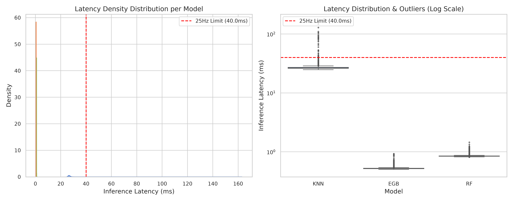
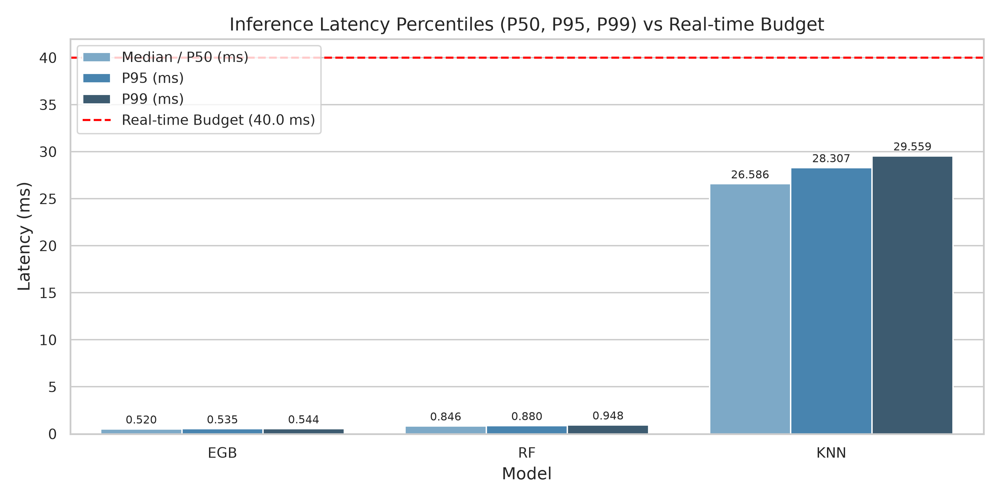
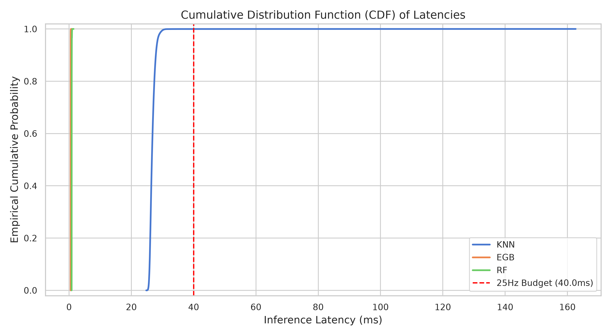
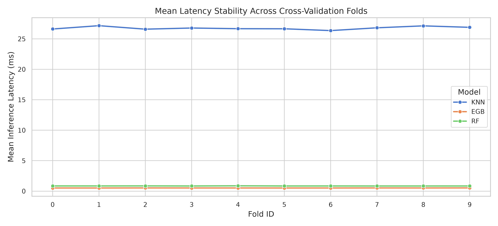

# Real-Time G-LOC Prediction: Latency & Performance Evaluation Report

## Executive Summary
This report evaluates per-sample inference latency for machine learning models streaming **Equivital** (ECG) and **Centrifuge** telemetry data for real-time **G-Induced Loss of Consciousness (G-LOC)** prediction. Data streaming is paced at **25.0 Hz**, which establishes a strict per-sample compute deadline of **40.00 ms**.

### Key Verdict: **SOME MODELS EXCEEDED REAL-TIME DEADLINES**
* **Fastest Model:** `EGB` with a mean latency of **0.5219 ms** (Throughput: **1915.9 samples/sec**).
* **Slowest Model:** `KNN` with a mean latency of **26.7662 ms** (Throughput: **37.4 samples/sec**).
* **Streaming Budget:** 40.00 ms per sample (25 Hz stream rate).

---

## Model Latency & Performance Comparison

| Model   |   Mean (ms) |   Std (ms) |   Median / P50 (ms) |   P95 (ms) |   P99 (ms) |   Max (ms) |   Throughput (samp/s) |   Compliance (<40ms) % |   F1 Score |
|:--------|------------:|-----------:|--------------------:|-----------:|-----------:|-----------:|----------------------:|-----------------------:|-----------:|
| EGB     |      0.5219 |     0.0093 |              0.5204 |     0.5352 |     0.5437 |     0.9273 |             1915.9317 |               100.0000 |     0.9669 |
| RF      |      0.8512 |     0.0217 |              0.8460 |     0.8802 |     0.9483 |     1.4504 |             1174.8796 |               100.0000 |     0.6020 |
| KNN     |     26.7662 |     1.2764 |             26.5855 |    28.3068 |    29.5585 |   162.6448 |               37.3606 |                99.9785 |     0.8326 |

---

## Statistical Significance Analysis
To verify whether latency differences between evaluated models are statistically significant, a **Kruskal-Wallis H-test** was performed on the per-sample inference latencies across all folds:
* **H-Statistic / Test Statistic:** `497896.09580634907`
* **p-value:** `0.0000e+00`
* **Statistically Significant ($lpha=0.05$):** `True`

---

## Visual Diagnostic Plots

### 1. Latency Distribution & Outliers
Density distributions and boxplots showing the spread and scale of sample latencies relative to the 40 ms hard deadline.

### 2. Tail Latency Analysis (P50, P95, P99)
Comparison of median vs. extreme percentiles to ensure safety margins during peak workload.

### 3. Empirical Cumulative Distribution Function (CDF)
Empirical cumulative probability of predictions completing within time budgets.

### 4. Cross-Validation Stability
Stability of average model latency across 10 fold test sets.

---

## Recommendations for Real-Time Deployment
1. **Model Selection Trade-off:**
   * Select models balancing both F1-score and low P99 tail latency.
   * Tail latencies (P95/P99) are critical in physiological monitoring to prevent frame dropping or buffer buildup during sudden dynamic maneuvers.
2. **Buffer Safety Margin:**
   * Even the highest tail latencies observed should comfortably sit under the **40.0 ms** threshold to allow headroom for hardware interrupt jitter, telemetry LSL serialization overhead, and display rendering.
