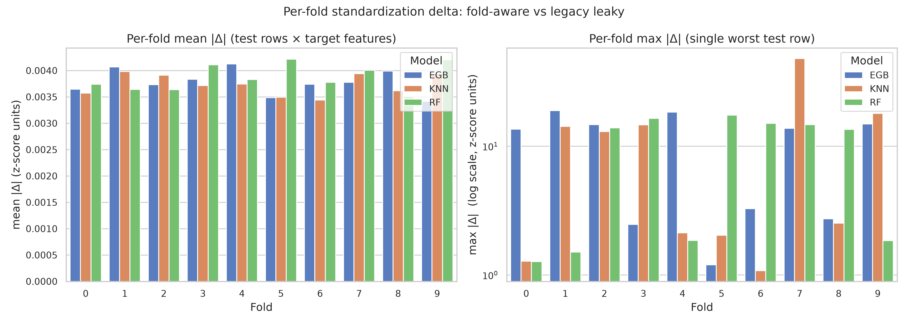
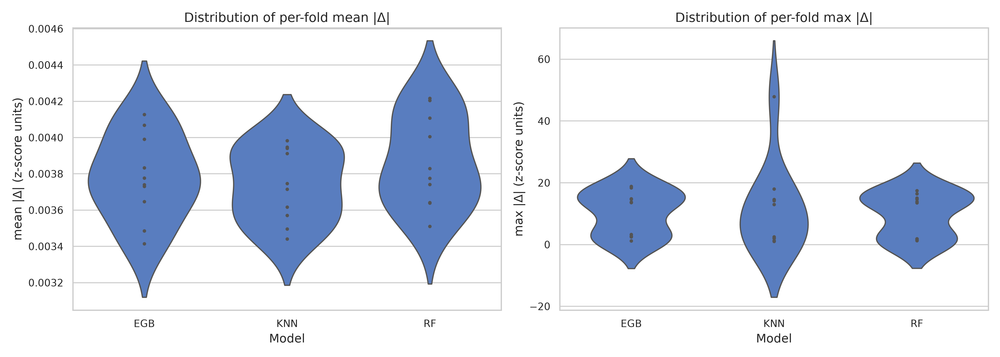
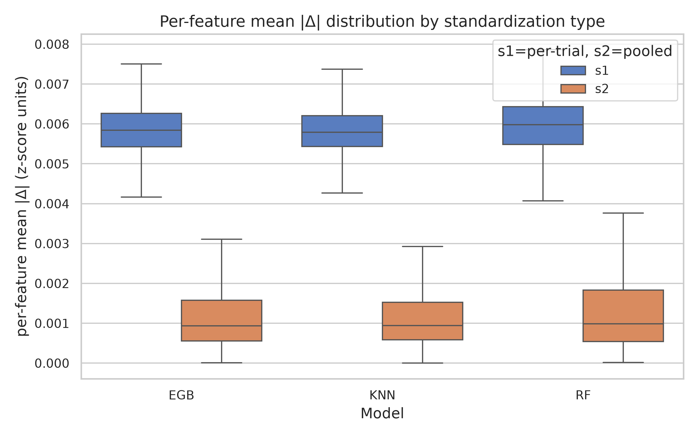
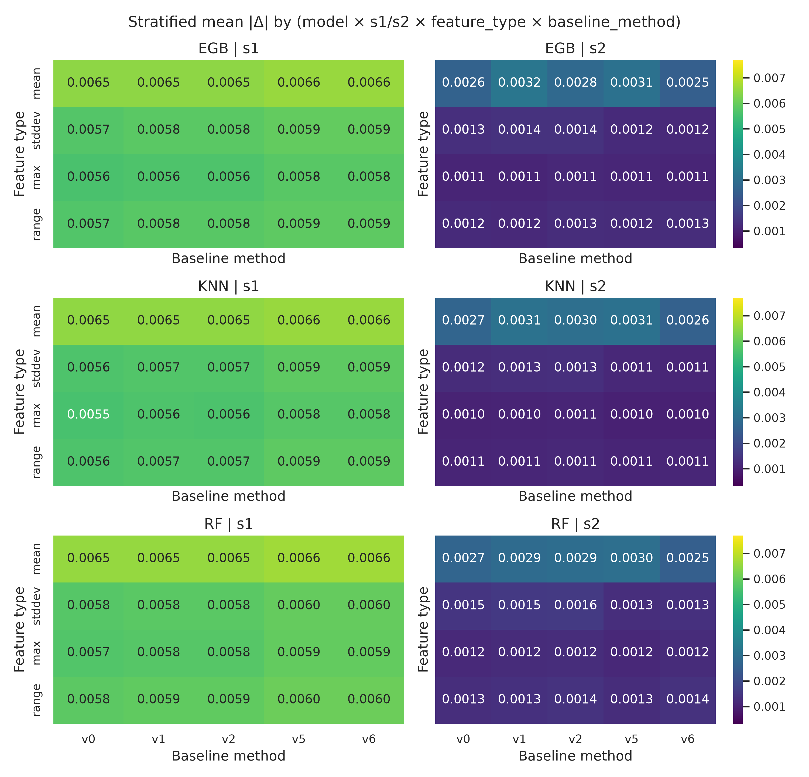
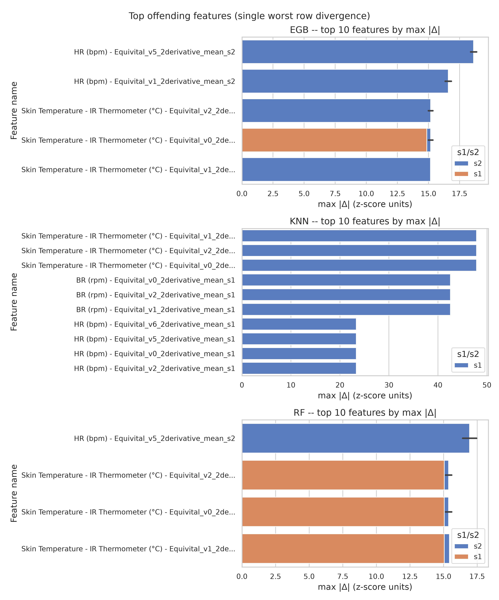

# Traditional Standardization Metrics Analysis Report

Comparing fold-aware (train-only) vs leaky (all-rows) standardization for traditional G-LOC models.

---

## Executive Summary

- Across **3** models and **10** folds per model, studying **888** unique target features.
- Mean of per-fold ``mean_abs_delta`` averaged across all models: **0.0038** z-score units.
- Globally worst single test-row z-score shift: **47.8775** z-score units.
- **Severe** leakage classification for: EGB, KNN, RF.
- The fold-aware standardization is therefore **necessary** to prevent test-row z-score contamination from the legacy
  all-rows computation.

---

## Configuration

The metrics were computed by `traditional_standardization_metrics.py` using the following config:

| key               | value                                                    |
|-------------------|----------------------------------------------------------|
| num_splits        | 10                                                       |
| random_seed       | 42                                                       |
| model_type_string | ModelType(afe_filter='Complete', feature_set='Explicit') |
| feature_streams   | ['ECG', 'Centrifuge']                                    |
| target_substrings | ['Equivital', 'Centrifuge']                              |

Severity thresholds used in this report:

| threshold         | value |
|-------------------|-------|
| benign_mean_abs   | 0.005 |
| moderate_mean_abs | 0.05  |
| benign_max_abs    | 0.1   |
| moderate_max_abs  | 1.0   |

---

## Data Layout

| model | folds | train_rows_mean | test_rows_mean | target_features | total_feature_cols |
|-------|-------|-----------------|----------------|-----------------|--------------------|
| EGB   | 10    | 167885.1000     | 18653.9000     | 888             | 6836               |
| KNN   | 10    | 167399.1000     | 18599.9000     | 888             | 6836               |
| RF    | 10    | 168857.1000     | 18761.9000     | 888             | 6836               |

---

## Headline Findings (per-model)

| model | n_folds | mean_abs_delta_mean | mean_abs_delta_median | mean_abs_delta_std | mean_abs_delta_max | max_abs_delta_mean | max_abs_delta_max |
|-------|---------|---------------------|-----------------------|--------------------|--------------------|--------------------|-------------------|
| EGB   | 10      | 0.0038              | 0.0038                | 0.0002             | 0.0041             | 10.3804            | 18.8660           |
| KNN   | 10      | 0.0037              | 0.0037                | 0.0002             | 0.0040             | 11.6748            | 47.8775           |
| RF    | 10      | 0.0039              | 0.0038                | 0.0002             | 0.0042             | 9.7484             | 17.4559           |

---

## Per-Fold Stability

| model | fold_id | n_train_rows | n_test_rows | mean_abs_delta | median_abs_delta | max_abs_delta | std_abs_delta |
|-------|---------|--------------|-------------|----------------|------------------|---------------|---------------|
| EGB   | 0       | 167885       | 18654       | 0.0036         | 0.0014           | 13.5741       | 0.0133        |
| EGB   | 1       | 167885       | 18654       | 0.0041         | 0.0016           | 18.8660       | 0.0225        |
| EGB   | 2       | 167885       | 18654       | 0.0037         | 0.0016           | 14.6903       | 0.0155        |
| EGB   | 3       | 167885       | 18654       | 0.0038         | 0.0015           | 2.4673        | 0.0108        |
| EGB   | 4       | 167885       | 18654       | 0.0041         | 0.0014           | 18.3825       | 0.0221        |
| EGB   | 5       | 167885       | 18654       | 0.0035         | 0.0013           | 1.1991        | 0.0071        |
| EGB   | 6       | 167885       | 18654       | 0.0037         | 0.0013           | 3.2691        | 0.0114        |
| EGB   | 7       | 167885       | 18654       | 0.0038         | 0.0016           | 13.7552       | 0.0138        |
| EGB   | 8       | 167885       | 18654       | 0.0040         | 0.0016           | 2.7326        | 0.0139        |
| EGB   | 9       | 167886       | 18653       | 0.0034         | 0.0012           | 14.8675       | 0.0144        |
| KNN   | 0       | 167399       | 18600       | 0.0036         | 0.0013           | 1.2799        | 0.0091        |
| KNN   | 1       | 167399       | 18600       | 0.0040         | 0.0015           | 14.2488       | 0.0179        |
| KNN   | 2       | 167399       | 18600       | 0.0039         | 0.0017           | 13.0004       | 0.0109        |
| KNN   | 3       | 167399       | 18600       | 0.0037         | 0.0013           | 14.6287       | 0.0163        |
| KNN   | 4       | 167399       | 18600       | 0.0037         | 0.0015           | 2.1189        | 0.0077        |
| KNN   | 5       | 167399       | 18600       | 0.0035         | 0.0012           | 2.0370        | 0.0076        |
| KNN   | 6       | 167399       | 18600       | 0.0034         | 0.0012           | 1.0779        | 0.0069        |
| KNN   | 7       | 167399       | 18600       | 0.0039         | 0.0017           | 47.8775       | 0.0502        |
| KNN   | 8       | 167399       | 18600       | 0.0036         | 0.0015           | 2.5258        | 0.0078        |
| KNN   | 9       | 167400       | 18599       | 0.0039         | 0.0014           | 17.9535       | 0.0233        |
| RF    | 0       | 168857       | 18762       | 0.0037         | 0.0013           | 1.2695        | 0.0092        |
| RF    | 1       | 168857       | 18762       | 0.0036         | 0.0015           | 1.5039        | 0.0092        |
| RF    | 2       | 168857       | 18762       | 0.0036         | 0.0014           | 13.8700       | 0.0135        |
| RF    | 3       | 168857       | 18762       | 0.0041         | 0.0015           | 16.4175       | 0.0219        |
| RF    | 4       | 168857       | 18762       | 0.0038         | 0.0017           | 1.8571        | 0.0114        |
| RF    | 5       | 168857       | 18762       | 0.0042         | 0.0015           | 17.4559       | 0.0222        |
| RF    | 6       | 168857       | 18762       | 0.0038         | 0.0016           | 15.0556       | 0.0152        |
| RF    | 7       | 168857       | 18762       | 0.0040         | 0.0017           | 14.7122       | 0.0209        |
| RF    | 8       | 168857       | 18762       | 0.0035         | 0.0012           | 13.4975       | 0.0151        |
| RF    | 9       | 168858       | 18761       | 0.0042         | 0.0019           | 1.8445        | 0.0141        |

---

## s1 (per-trial) vs s2 (pooled) Comparison

| model | s1_or_s2 | mean_of_mean_abs | median_of_mean_abs | std_of_mean_abs | max_of_mean_abs |
|-------|----------|------------------|--------------------|-----------------|-----------------|
| EGB   | s1       | 0.0059           | 0.0058             | 0.0008          | 0.0102          |
| EGB   | s2       | 0.0016           | 0.0009             | 0.0030          | 0.0474          |
| KNN   | s1       | 0.0059           | 0.0058             | 0.0009          | 0.0144          |
| KNN   | s2       | 0.0016           | 0.0009             | 0.0029          | 0.0482          |
| RF    | s1       | 0.0060           | 0.0060             | 0.0008          | 0.0101          |
| RF    | s2       | 0.0017           | 0.0010             | 0.0029          | 0.0455          |

---

## Stratified Breakdown (feature_type × baseline_method)

Each cell is the mean across all folds of the (s1/s2 × feature_type × baseline_method) bucket's ``mean_abs_delta``.

### S1

| model | feature_type | v0     | v1     | v2     | v5     | v6     | none |
|-------|--------------|--------|--------|--------|--------|--------|------|
| EGB   | max          | 0.0056 | 0.0056 | 0.0056 | 0.0058 | 0.0058 | nan  |
| EGB   | mean         | 0.0065 | 0.0065 | 0.0065 | 0.0066 | 0.0066 | nan  |
| EGB   | range        | 0.0057 | 0.0058 | 0.0058 | 0.0059 | 0.0059 | nan  |
| EGB   | stddev       | 0.0057 | 0.0058 | 0.0058 | 0.0059 | 0.0059 | nan  |
| KNN   | max          | 0.0055 | 0.0056 | 0.0056 | 0.0058 | 0.0058 | nan  |
| KNN   | mean         | 0.0065 | 0.0065 | 0.0065 | 0.0066 | 0.0066 | nan  |
| KNN   | range        | 0.0056 | 0.0057 | 0.0057 | 0.0059 | 0.0059 | nan  |
| KNN   | stddev       | 0.0056 | 0.0057 | 0.0057 | 0.0059 | 0.0059 | nan  |
| RF    | max          | 0.0057 | 0.0058 | 0.0058 | 0.0059 | 0.0059 | nan  |
| RF    | mean         | 0.0065 | 0.0065 | 0.0065 | 0.0066 | 0.0066 | nan  |
| RF    | range        | 0.0058 | 0.0059 | 0.0059 | 0.0060 | 0.0060 | nan  |
| RF    | stddev       | 0.0058 | 0.0058 | 0.0058 | 0.0060 | 0.0060 | nan  |

### S2

| model | feature_type | v0     | v1     | v2     | v5     | v6     | none |
|-------|--------------|--------|--------|--------|--------|--------|------|
| EGB   | max          | 0.0011 | 0.0011 | 0.0011 | 0.0011 | 0.0011 | nan  |
| EGB   | mean         | 0.0026 | 0.0032 | 0.0028 | 0.0031 | 0.0025 | nan  |
| EGB   | range        | 0.0012 | 0.0012 | 0.0013 | 0.0012 | 0.0013 | nan  |
| EGB   | stddev       | 0.0013 | 0.0014 | 0.0014 | 0.0012 | 0.0012 | nan  |
| KNN   | max          | 0.0010 | 0.0010 | 0.0011 | 0.0010 | 0.0010 | nan  |
| KNN   | mean         | 0.0027 | 0.0031 | 0.0030 | 0.0031 | 0.0026 | nan  |
| KNN   | range        | 0.0011 | 0.0011 | 0.0011 | 0.0011 | 0.0011 | nan  |
| KNN   | stddev       | 0.0012 | 0.0013 | 0.0013 | 0.0011 | 0.0011 | nan  |
| RF    | max          | 0.0012 | 0.0012 | 0.0012 | 0.0012 | 0.0012 | nan  |
| RF    | mean         | 0.0027 | 0.0029 | 0.0029 | 0.0030 | 0.0025 | nan  |
| RF    | range        | 0.0013 | 0.0013 | 0.0014 | 0.0013 | 0.0014 | nan  |
| RF    | stddev       | 0.0015 | 0.0015 | 0.0016 | 0.0013 | 0.0013 | nan  |

---

## Worst Offending Features (top 10 per model)

### EGB

| rank | fold_id | feature_name                                                              | max_abs_delta | mean_abs_delta | s1_or_s2 | feature_type | baseline_method |
|------|---------|---------------------------------------------------------------------------|---------------|----------------|----------|--------------|-----------------|
| 1    | 1       | HR (bpm) - Equivital_v5_2derivative_mean_s2                               | 18.8660       | 0.0474         | s2       | mean         | v5              |
| 2    | 4       | HR (bpm) - Equivital_v5_2derivative_mean_s2                               | 18.3825       | 0.0466         | s2       | mean         | v5              |
| 3    | 1       | HR (bpm) - Equivital_v1_2derivative_mean_s2                               | 16.8378       | 0.0446         | s2       | mean         | v1              |
| 4    | 4       | HR (bpm) - Equivital_v1_2derivative_mean_s2                               | 16.3347       | 0.0436         | s2       | mean         | v1              |
| 5    | 4       | Skin Temperature - IR Thermometer (°C) - Equivital_v2_2derivative_mean_s2 | 15.3499       | 0.0125         | s2       | mean         | v2              |
| 6    | 4       | Skin Temperature - IR Thermometer (°C) - Equivital_v0_2derivative_mean_s2 | 15.3497       | 0.0125         | s2       | mean         | v0              |
| 7    | 4       | Skin Temperature - IR Thermometer (°C) - Equivital_v1_2derivative_mean_s2 | 15.1667       | 0.0127         | s2       | mean         | v1              |
| 8    | 1       | Skin Temperature - IR Thermometer (°C) - Equivital_v2_2derivative_mean_s2 | 14.9905       | 0.0121         | s2       | mean         | v2              |
| 9    | 1       | Skin Temperature - IR Thermometer (°C) - Equivital_v0_2derivative_mean_s2 | 14.9903       | 0.0121         | s2       | mean         | v0              |
| 10   | 9       | Skin Temperature - IR Thermometer (°C) - Equivital_v0_2derivative_mean_s1 | 14.8675       | 0.0079         | s1       | mean         | v0              |

### KNN

| rank | fold_id | feature_name                                                              | max_abs_delta | mean_abs_delta | s1_or_s2 | feature_type | baseline_method |
|------|---------|---------------------------------------------------------------------------|---------------|----------------|----------|--------------|-----------------|
| 1    | 7       | Skin Temperature - IR Thermometer (°C) - Equivital_v1_2derivative_mean_s1 | 47.8775       | 0.0133         | s1       | mean         | v1              |
| 2    | 7       | Skin Temperature - IR Thermometer (°C) - Equivital_v2_2derivative_mean_s1 | 47.8770       | 0.0133         | s1       | mean         | v2              |
| 3    | 7       | Skin Temperature - IR Thermometer (°C) - Equivital_v0_2derivative_mean_s1 | 47.8768       | 0.0133         | s1       | mean         | v0              |
| 4    | 7       | BR (rpm) - Equivital_v0_2derivative_mean_s1                               | 42.5637       | 0.0144         | s1       | mean         | v0              |
| 5    | 7       | BR (rpm) - Equivital_v2_2derivative_mean_s1                               | 42.5637       | 0.0144         | s1       | mean         | v2              |
| 6    | 7       | BR (rpm) - Equivital_v1_2derivative_mean_s1                               | 42.5633       | 0.0144         | s1       | mean         | v1              |
| 7    | 7       | HR (bpm) - Equivital_v6_2derivative_mean_s1                               | 23.3247       | 0.0132         | s1       | mean         | v6              |
| 8    | 7       | HR (bpm) - Equivital_v5_2derivative_mean_s1                               | 23.3246       | 0.0132         | s1       | mean         | v5              |
| 9    | 7       | HR (bpm) - Equivital_v0_2derivative_mean_s1                               | 23.3245       | 0.0132         | s1       | mean         | v0              |
| 10   | 7       | HR (bpm) - Equivital_v2_2derivative_mean_s1                               | 23.3245       | 0.0132         | s1       | mean         | v2              |

### RF

| rank | fold_id | feature_name                                                              | max_abs_delta | mean_abs_delta | s1_or_s2 | feature_type | baseline_method |
|------|---------|---------------------------------------------------------------------------|---------------|----------------|----------|--------------|-----------------|
| 1    | 5       | HR (bpm) - Equivital_v5_2derivative_mean_s2                               | 17.4559       | 0.0455         | s2       | mean         | v5              |
| 2    | 3       | HR (bpm) - Equivital_v5_2derivative_mean_s2                               | 16.4175       | 0.0433         | s2       | mean         | v5              |
| 3    | 5       | Skin Temperature - IR Thermometer (°C) - Equivital_v2_2derivative_mean_s2 | 15.6028       | 0.0136         | s2       | mean         | v2              |
| 4    | 5       | Skin Temperature - IR Thermometer (°C) - Equivital_v0_2derivative_mean_s2 | 15.6028       | 0.0136         | s2       | mean         | v0              |
| 5    | 5       | Skin Temperature - IR Thermometer (°C) - Equivital_v1_2derivative_mean_s2 | 15.4347       | 0.0139         | s2       | mean         | v1              |
| 6    | 3       | Skin Temperature - IR Thermometer (°C) - Equivital_v2_2derivative_mean_s2 | 15.1383       | 0.0131         | s2       | mean         | v2              |
| 7    | 3       | Skin Temperature - IR Thermometer (°C) - Equivital_v0_2derivative_mean_s2 | 15.1382       | 0.0131         | s2       | mean         | v0              |
| 8    | 6       | Skin Temperature - IR Thermometer (°C) - Equivital_v1_2derivative_mean_s1 | 15.0556       | 0.0070         | s1       | mean         | v1              |
| 9    | 6       | Skin Temperature - IR Thermometer (°C) - Equivital_v2_2derivative_mean_s1 | 15.0556       | 0.0070         | s1       | mean         | v2              |
| 10   | 6       | Skin Temperature - IR Thermometer (°C) - Equivital_v0_2derivative_mean_s1 | 15.0555       | 0.0070         | s1       | mean         | v0              |

---

## Leakage Severity Classification

Each model is placed into the worst bucket triggered by either its mean-test-row shift (mean family) or its worst
single-row shift (max family). Threshold values are z-score units.

| model | mean_abs_delta_mean | max_abs_delta_max | mean_severity | max_severity | overall_severity | triggers          |
|-------|---------------------|-------------------|---------------|--------------|------------------|-------------------|
| EGB   | 0.0038              | 18.8660           | benign        | severe       | severe           | max>1.0 (18.8660) |
| KNN   | 0.0037              | 47.8775           | benign        | severe       | severe           | max>1.0 (47.8775) |
| RF    | 0.0039              | 17.4559           | benign        | severe       | severe           | max>1.0 (17.4559) |

---

## Statistical Tests

### Wilcoxon signed-rank (H0: fold mean_abs_delta is zero)

| model | wilcoxon_stat | p_value | reject_h0_at_0_05 | interpretation                                            |
|-------|---------------|---------|-------------------|-----------------------------------------------------------|
| EGB   | 0.0000        | 0.0020  | 1                 | mean_abs_delta is statistically distinguishable from zero |
| KNN   | 0.0000        | 0.0020  | 1                 | mean_abs_delta is statistically distinguishable from zero |
| RF    | 0.0000        | 0.0020  | 1                 | mean_abs_delta is statistically distinguishable from zero |

### Fold-stability CV (across folds per model)

| model | mean_abs_delta_cv | fold_min | fold_max | fold_span_ratio | interpretation             |
|-------|-------------------|----------|----------|-----------------|----------------------------|
| EGB   | 0.0587            | 0.0034   | 0.0041   | 1.2086          | folds are stable (CV<0.25) |
| KNN   | 0.0512            | 0.0034   | 0.0040   | 1.1578          | folds are stable (CV<0.25) |
| RF    | 0.0617            | 0.0035   | 0.0042   | 1.2013          | folds are stable (CV<0.25) |

---

## Recommendations

- **Severe divergence detected** (EGB, KNN, RF): the legacy leaky standardization would shift at least one test row's
  z-score by more than 1 σ compared to the fold-aware computation. The current fold-aware standardization (see
  `../../Data_Pipeline/fold_standardizer.py`) is **essential** for reporting unbiased model performance.

- All models exhibit fold stability (CV < 0.25), so the mean across folds is a reliable summary statistic.

---

## Reproducibility

- Source data: `../../../Results/Traditional_Standardization_Metrics/summary.json` produced by
  `python -m src.real_time.traditional_standardization_metrics`.
- Random seed: `42`. Number of splits: `10`.
- Model type: `ModelType(afe_filter='Complete', feature_set='Explicit')`.
- Feature stream filters applied by the producer: ['Equivital', 'Centrifuge'].
- All numerical thresholds used by this report are listed in the Configuration section above. Re-running
  `python -m src.real_time.standardization_metrics_analysis` will reproduce every file in this directory
  byte-identically.
